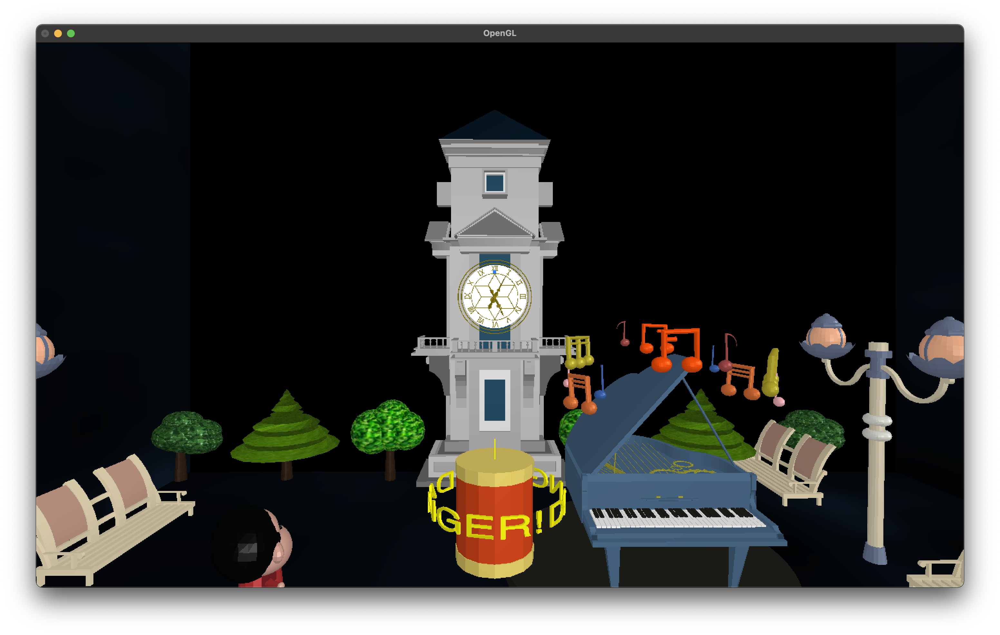
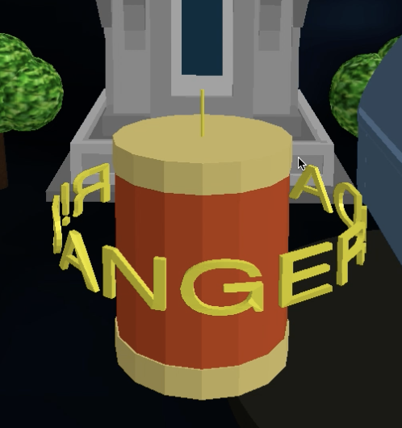
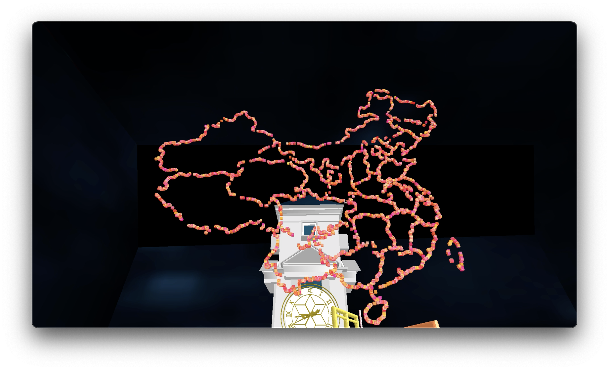
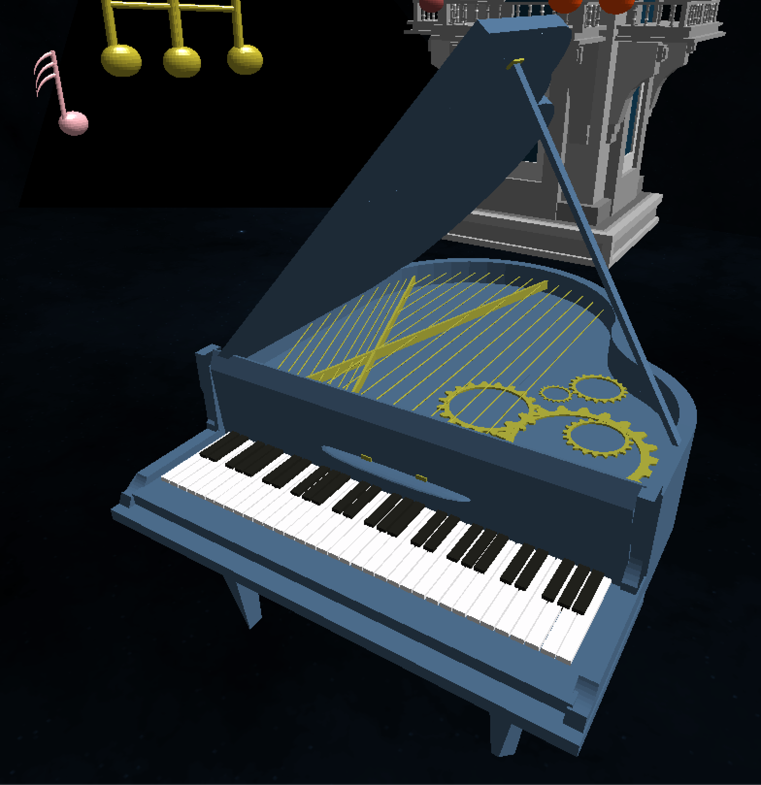
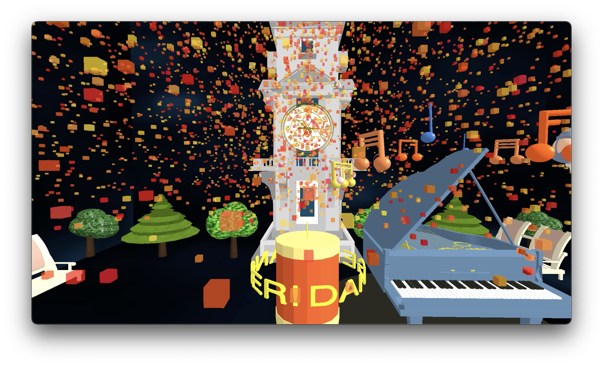
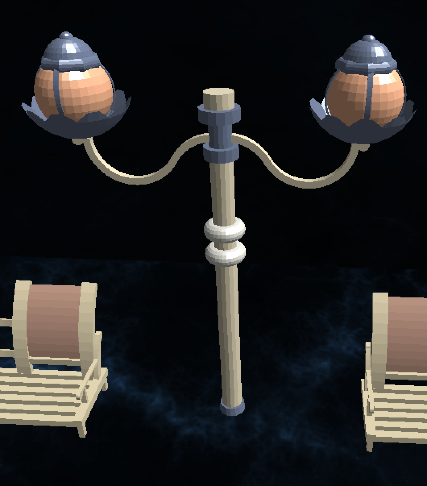
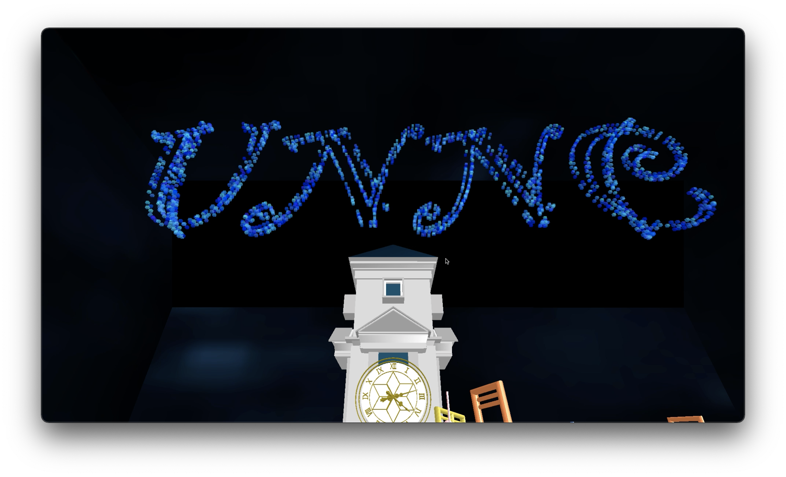

This is *University of Nottingham Ningbo China*, *Computer Science*, *Computer Graphics* coursework, completed in Dec 2021.

## Overview

Use OpenGL to create a scene in UNNC, including bell tower, firework etc. 

### Usage

- To run the code, you should have GLUT, GLEW, and of course OpenGL set up. For Win, some lines for including header files might be in different form.  

- For Mac OS, if only absolute path works on your device, change it in `Util.hpp` . Windows user can simply change it to empty string.

- Use `w` `a`  `s` `d` to control viewpoint. 

## Object Loader

The most useful part for you might be **object loader**. Our loader can read `.obj` and `.mtl` files, allowing imported model to display colour, material and texture. It is in `cg-cw/model/Loader.cpp`.  We tested this loader on Cinema4D-generated and Blende-generated `.obj` and `.mtl` files. Other software-generated files should also work as long as they follow specific format. See examples in `cg-cw/model/` .  

Note that for using **texture**, either on imported model or OpenGL-created model, only `.bmp` files are allowed. If you are using Mac, find a way to do the conversion. Btw, large texture images (approximately more than 200KB) will significantly affect the performance, so just use small images instead.

### Some Effect

